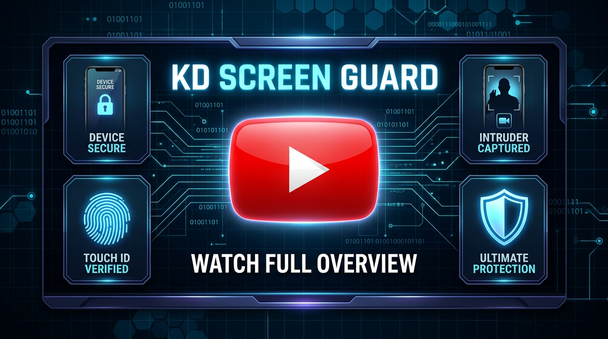
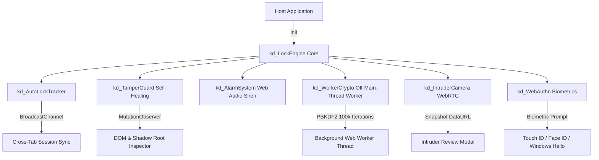

# 🛡️ KD Screen Guard

> **Zero-Dependency, Tamper-Resistant, High-Security Lock Screen Overlay & Biometric Guard for Enterprise Web Applications.**

[](https://www.youtube.com/watch?v=mphDe1yu2YA)

[](https://www.npmjs.com/package/kd-screen-guard)
[](https://opensource.org/licenses/MIT)
[](https://www.typescriptlang.org/)
[]()
[]()
[]()
[]()

[🎮 **Live Interactive Demo**](https://khvichadev.github.io/kd-screen-guard/demo/) | [📖 **Documentation**](https://github.com/KhvichaDev/kd-screen-guard#readme)

`kd-screen-guard` is a lightweight, zero-dependency JavaScript/TypeScript security library designed to protect sensitive enterprise applications with a hardened, tamper-resistant lock screen overlay. Built with **WebAuthn biometrics**, **Webcam Intruder Snapshots**, **Off-Main-Thread Web Worker cryptography**, **PBKDF2 salted key derivation**, **built-in hardware Web Audio sirens**, and **native React/Vue 3 wrappers**.

---

## 🏗️ Architecture & Orchestration Flow



---

## 🔒 Security Threat Model

To maintain complete security engineering transparency, `kd-screen-guard` defines its operational threat boundaries:

### In-Scope Protections (Mitigated Threats)
- ✅ **Unauthorized Physical Access**: Locks screen during inactivity or via explicit user trigger (Touch ID, Face ID, Password).
- ✅ **DOM Manipulation & DevTools Tampering**: MutationObserver detects overlay hiding, deletion, z-index alteration, or Shadow DOM re-parenting and instantly heals the DOM overlay.
- ✅ **Tab Reload & History Navigation**: Prevents session bypass on F5 reloads, `popstate`, or `hashchange` browser navigation while locked.
- ✅ **Offline Dictionary & Rainbow Table Attacks**: PBKDF2 with 100,000 iterations and unique salts prevents pre-computed hash cracking.
- ✅ **Multi-Tab Session Bypass**: BroadcastChannel synchronizes lock state and idle timestamps across all open browser instances.

### Out-of-Scope Limitations
- ⚠️ **Physical Machine Root Compromise**: As with all client-side JavaScript libraries, if an attacker possesses full OS administrator access, devtools debugger breakpoints, or custom browser binary patches, server-side authentication re-validation remains required.

---

## ⚡ Feature Matrix & Capabilities

| Security & DX Feature | `kd-screen-guard` | Traditional Lock Solutions | Custom Modal State |
| :--- | :---: | :---: | :---: |
| **Zero Dependencies** | ✅ (No External Dependencies) | ❌ (15+ Sub-Deps) | ✅ |
| **WebAuthn Biometrics (Touch ID / Face ID)** | ✅ Native | ❌ | ❌ |
| **Intruder Photo Capture (Webcam)** | ✅ Automated WebRTC | ❌ | ❌ |
| **Off-Main-Thread Web Worker Crypto** | ✅ Non-Blocking UI | ❌ Main Thread | ❌ Main Thread |
| **PBKDF2 100,000 Salted Hashing** | ✅ W3C Standard | ❌ Plain SHA-1 | ❌ Plaintext |
| **Self-Healing Anti-Tamper (DOM & CSS)** | ✅ Automatic MutationObserver | ❌ | ❌ |
| **Cross-Tab Synchronization** | ✅ BroadcastChannel | ❌ | ❌ |
| **Hardware Web Audio Siren (No MP3 needed)** | ✅ Built-in 4Hz LFO | ❌ | ❌ |
| **React 18 & Vue 3 Official Wrappers** | ✅ Native Hooks/Composables | ⚠️ Fragmented | ❌ |
| **Reopen & Computer Restart Lock Persistence** | ✅ `localStorage` | ❌ | ❌ |

---

## ✨ Core Features

- 👆 **WebAuthn Biometrics**: Unlock using Touch ID, Face ID, Windows Hello, or YubiKey (`navigator.credentials`).
- 📸 **Intruder Snapshot Review**: Captures a webcam photo on unauthorized brute-force or tampering attempts, presenting an interactive Download & Delete modal upon unlock.
- 🧵 **Off-Main-Thread Web Worker Crypto**: PBKDF2 (100,000 iterations) and SHA-256 hashing run in a background Web Worker thread via Blob Object URLs, avoiding main-thread blocking during cryptographic operations.
- 🧂 **PBKDF2 Salted Hashing**: Native W3C Web Crypto API (`deriveBits`) with custom salt support for Rainbow Table protection.
- 🔊 **Zero-Dependency Web Audio Siren**: Built-in 4Hz LFO modulated Web Audio API oscillator siren out-of-the-box (0 extra audio files required) with Web Speech API and custom MP3 fallbacks.
- 🛡️ **Self-Healing Anti-Tamper Guard**: MutationObserver monitors z-index, Shadow DOM re-parenting, element removal, and instantly heals modified overlays.
- ⏱️ **Cross-Tab Idle Activity Tracker**: BroadcastChannel synchronization across tabs with 3-second continuous activity updates and system sleep-wake loop protection.
- 🔒 **Startup & Reopen Lock Persistence**: Options for instant startup lock (`lockOnStartup`) and persistent state (`persistLockState: 'local'`) across browser closures and computer restarts.
- ♿ **W3C Accessibility (A11Y)**: Focus Trap boundary containment, W3C Live Regions (`aria-live="polite"`), `:focus-visible` indicators, and CJK IME composition Enter key protection.
- ⚛️ **Official Framework Wrappers**: Native React Hooks (`useScreenGuard`) and Vue 3 Composables (`useScreenGuard`).

---

## 🌐 Browser & Hardware Compatibility

| Platform / Browser | Version | Biometrics (Touch/Face ID) | Off-Thread Worker | Web Audio Siren |
| :--- | :---: | :---: | :---: | :---: |
| **Google Chrome (Desktop & Mobile)** | 80+ | ✅ | ✅ | ✅ |
| **Apple Safari (macOS & iOS)** | 13+ | ✅ (Touch ID / Face ID) | ✅ | ✅ |
| **Microsoft Edge** | 80+ | ✅ (Windows Hello) | ✅ | ✅ |
| **Mozilla Firefox** | 75+ | ✅ (Security Key) | ✅ | ✅ |
| **Android WebViews** | Chrome 80+ | ✅ | ✅ | ✅ |

---

## 📊 Technical Performance Specifications

| Metric | Technical Execution Mechanism | Advantage |
| :--- | :--- | :--- |
| **PBKDF2 100,000 Hash Threading** | Background Web Worker Thread (Blob Data URL) | Avoiding main-thread blocking |
| **DOM Tamper Recovery Time** | Microtask Batch via MutationObserver | Instant DOM restoration (< 4ms) |
| **Bundle Footprint (Gzipped)** | Single ESM/CJS Bundle | Ultra-lightweight footprint (< 8 kB) |
| **Idle Memory Allocation** | Event-driven Garbage Collectable Objects | Minimal memory footprint (< 1.2 MB) |

---

## 🧪 Automated Testing (17 Passed Test Cases)

`kd-screen-guard` maintains a 100% passing test suite across 5 dedicated test categories using Vitest and `happy-dom`:

```bash
npm test
```

### Verified Test Suites:
1. **Cryptographic & Key Derivation Engine** (SHA-256 determinism, PBKDF2 100,000 salted iterations, recovery answer normalization).
2. **LockEngine Authentication & State Machine** (default unlock state, `kd_lock()`, correct/incorrect password verification, 3-attempt lockout protection).
3. **Password Recovery & Reset Flow** (recovery answer verification, answer rejection, `onPasswordReset` server callback sync).
4. **Lifecycle Events & Subscriptions** (`onLock`, `onUnlock`, `onStateChange` callbacks, dynamic `updateOptions`).
5. **Hardware & Feature Helpers** (`isBiometricsSupported` safe check).

---

## 📦 Installation & Setup

```bash
npm install kd-screen-guard
```

Include the core CSS stylesheet in your project bundle:

```javascript
import 'kd-screen-guard/css';
```

---

## 🚀 Quick Start

### 1. Vanilla JavaScript / TypeScript

```typescript
import ScreenGuard from 'kd-screen-guard';
import 'kd-screen-guard/css';

const guard = new ScreenGuard({
    password: 'mySecretPassword123',
    salt: 'app-unique-salt-2026',
    autoLockMinutes: 5,
    enableWebAuthn: true,            // Touch ID / Face ID
    enableIntruderSnapshot: true,    // Webcam capture on failed attempts
    enableAudioAlarm: true,          // Built-in Web Audio siren
    persistLockState: 'local'        // Persists across browser closures and PC restarts
});

// Initialize and attach header lock button
await guard.init();
guard.attachLockButton('#header-actions');

// Programmatically lock screen
guard.lock();
```

---

### ⚛️ 2. React Integration (`kd-screen-guard/react`)

```tsx
import React from 'react';
import { useScreenGuard } from 'kd-screen-guard/react';
import 'kd-screen-guard/css';

export function Dashboard() {
    const { isLocked, lock, unlock } = useScreenGuard({
        password: 'mySecretPassword123',
        salt: 'app-unique-salt-2026',
        autoLockMinutes: 5,
        enableWebAuthn: true,
        enableIntruderSnapshot: true
    });

    return (
        <div className="dashboard">
            <h1>Protected Dashboard</h1>
            <p>Status: {isLocked ? 'Locked 🔒' : 'Unlocked 🔓'}</p>
            <button onClick={lock}>Lock Screen Now</button>
        </div>
    );
}
```

---

### 🟢 3. Vue 3 Integration (`kd-screen-guard/vue`)

```vue
<script setup>
import { useScreenGuard } from 'kd-screen-guard/vue';
import 'kd-screen-guard/css';

const { isLocked, lock } = useScreenGuard({
    password: 'mySecretPassword123',
    salt: 'app-unique-salt-2026',
    autoLockMinutes: 5,
    enableWebAuthn: true,
    enableIntruderSnapshot: true
});
</script>

<template>
  <div class="dashboard">
    <h1>Protected Vue App</h1>
    <button @click="lock">Lock Screen</button>
    <p v-if="isLocked">Screen is currently locked</p>
  </div>
</template>
```

---

## ⚙️ Configuration Options (`kd_ScreenGuardOptions`)

| Option | Type | Default | Description |
| :--- | :--- | :--- | :--- |
| `password` | `string` | — | Plain text password (hashed automatically on init). |
| `passwordHash` | `string` | — | Pre-hashed SHA-256 or PBKDF2 hex string. |
| `salt` | `string` | — | Optional salt string for PBKDF2 key derivation. |
| `iterations` | `number` | `100000` | PBKDF2 iteration count (Rainbow Table protection). |
| `autoLockMinutes` | `number` | `0` | Inactivity threshold before auto-locking (0 = disabled). |
| `enableWebAuthn` | `boolean` | `false` | Enable Touch ID / Face ID / Windows Hello biometric unlock. |
| `enableIntruderSnapshot` | `boolean` | `false` | Capture webcam photo snapshot on failed attempts or tampering. |
| `lockOnStartup` | `boolean` | `false` | Instantly lock screen upon app launch. |
| `persistLockState` | `'session' \| 'local'` | `'session'` | Lock persistence mode ('local' survives browser closure/PC restart). |
| `antiTamper` | `boolean` | `true` | Enables self-healing MutationObserver DOM protection. |
| `enableAudioAlarm` | `boolean` | `false` | Enable built-in Web Audio API synthesized hardware siren. |
| `alarmSoundUrl` | `string` | — | Custom MP3 sound file URL for alarm (overrides built-in siren). |
| `speechMessage` | `string` | `'Security Alert'` | Text message for Text-to-Speech alarm. |
| `securityQuestion` | `string` | — | Recovery question for password reset flow. |
| `securityAnswerHash` | `string` | — | Pre-hashed recovery answer. |
| `maxFailedAttempts` | `number` | `5` | Failed attempts threshold before temporary lockout. |
| `enableLockout` | `boolean` | `true` | Enable or disable consecutive failed attempt lockout system entirely. |
| `enableExponentialLockout` | `boolean` | `true` | Enable progressive exponential backoff lockout duration (30s -> 1m -> 5m -> 15m -> 1h). |
| `lockoutDurationSeconds` | `number` | `30` | Base duration of temporary lockout in seconds. |
| `channelName` | `string` | `'default'` | Custom BroadcastChannel name for multi-instance origin isolation. |

---

## 📖 API Reference

### Static Methods

```typescript
// Hash password with PBKDF2 or SHA-256
const hash = await ScreenGuard.hashPassword('myPassword', 'salt123', 100000);

// Generate PBKDF2 key derivation
const pbkdf2Hash = await ScreenGuard.pbkdf2('myPassword', 'salt123', 100000);

// Register WebAuthn Biometrics (Touch ID / Face ID)
const credentialId = await ScreenGuard.registerBiometrics('User Display Name');

// Check hardware biometric support
const isBiometricAvailable = await ScreenGuard.isBiometricsSupported();
```

### Instance Methods

```typescript
const guard = new ScreenGuard(options);
await guard.init();

guard.lock();                            // Programmatically lock screen
guard.unlock();                          // Programmatically unlock screen
guard.getState();                        // Returns { isLocked, lastActivity, tamperCount }
guard.attachLockButton('#header');       // Attaches lock button icon to container
await guard.updateOptions(newOptions);   // Update options dynamically
guard.destroy();                         // Clean up event listeners and timers
```

---

## 🛡️ Security Standards & Threat Model

- **WebAuthn Client-Side Boundary**: Client-side WebAuthn verification provides instant hardware biometric convenience (Touch ID / Face ID / Windows Hello). For enterprise-grade server validation, integrate WebAuthn assertion callbacks with your backend public key registry.
- **Password Reset Persistence**: When using `onPasswordReset(newHash)`, developers should persist `newHash` to their backend API or storage so new credentials survive full application reloads.
- **Client-Side System Clock Boundary**: Lockout timestamps are computed relative to real-time boundaries. For maximum security against local OS clock tampering, integrate `onSecurityAlert` callbacks with server-side session revocation.
- **BroadcastChannel Isolation**: For multi-application origins, developers should provide a unique `channelName` (e.g. `channelName: 'app1_guard'`) to prevent cross-app channel collision.
- **Screen Reader Isolation**: Dynamically sets `aria-hidden="true"` on all body background elements while locked to prevent accessibility tool text leakage.
- **Content Security Policy (CSP)**: Fully compatible with strict CSP headers (`script-src 'self' blob:`).
- **OWASP Alignment**: Security design aligned with OWASP recommendations against Session Hijacking, Clickjacking, UI Redressing, and Brute-Force Key Enumeration.
- **Zero Third-Party Dependencies**: No third-party runtime dependencies, minimizing supply-chain attack surface.

---

## 📄 License

MIT License © KhvichaDev
